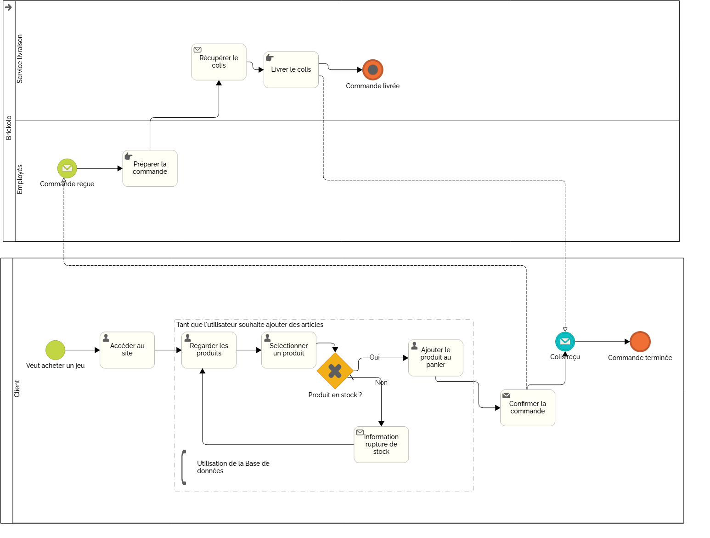

= Fiche Conseil
:toc-title: Sommaire
:toc: macro

*Par :* _Ducry Pierre-Louis, Da Chao Romain, Razafinirina Mialisoa, Pellegatta Matteo_ +
*Équipe :* 2A7

---
toc::[]
---
== I. La liste des mentions légales
=== Mentions légales 
==== 1. Les données d’identification du propriétaire du site :
* Dénomination ou raison sociale
* Adresse du siège social
* Capital social
* Numéro de téléphone
* Directeur de publication 
* Numéro d’identification si vous êtes inscrit au Registre du Commerce et des Sociétés (RCS) ou au répertoire des métiers.

==== 2. Les données d’identification du responsable éditorial
Nom du directeur de la publication ou du codirecteur de la publication ou du responsable de la rédaction.

==== 3. Les données d’identification de l’hébergeur du site
* Le nom de l'hébergeur et sa raison sociale
* Son adresse 
* Son numéro de téléphone

==== 4. Politique de gestion des cookies (l’utilisation de cookies)
Depuis le 31 mars 2021, la loi RGPD prévoit la mention de l’utilisation de cookies (des traceurs informatiques qui permettent d’analyser le comportement d’un visiteur). Les internautes sont donc soumis à un consentement, ayant pour objectif de personnaliser les données qu’ils autorisent à tracer. 

Le site doit donc : 

* expliquer l’utilisation des cookies
* demander le consentement de l’internaute lui donner la possibilité de refuser

==== 5. Politique de confidentialité : l’utilisation des données personnelles

* Coordonnées du DPD (délégué à la protection des données de l’entreprise) ou d’une personne référente en cas de questions liées à la protection des données personnelles
* Raison de la collecte des données
* Caractère obligatoire ou facultatif des réponses de l’internaute et les conséquences s’il décide de ne pas y répondre
* Destinataire des données 
* Donner au visiteur  le droit d’opposition, d’interrogation, d’accès et de rectification
* Si besoin, préciser les transferts de données à caractère personnel à destination d’un pays hors Union européenne
* Autorisation légale de leur traitement
* Faire mention de la possibilité de porter plainte auprès de la CNIL

6. Conditions générales de vente (CGV) pour les transactions commerciales.

=== Mentions actuellement manquantes sur le site 
* Informations sur l'hébergeur.
* Politique de confidentialité claire et explicite.

== II. Une description détaillée du processus de vente en ligne

== III. Protection des Données - Mesures et Modalités

== IV. Sécurité des Données - Mesures et Modalités

== V. La liste des US à ajouter au dernier sprint pour tenir compte des points 3 et 4 les plus importants
* Ajouter une case à cocher pour le consentement explicite lors de l'inscription.
* Ajouter une page de politique de confidentialité détaillée.
* Ajouter un bandeau d'acceptation des cookies conforme au RGPD.

