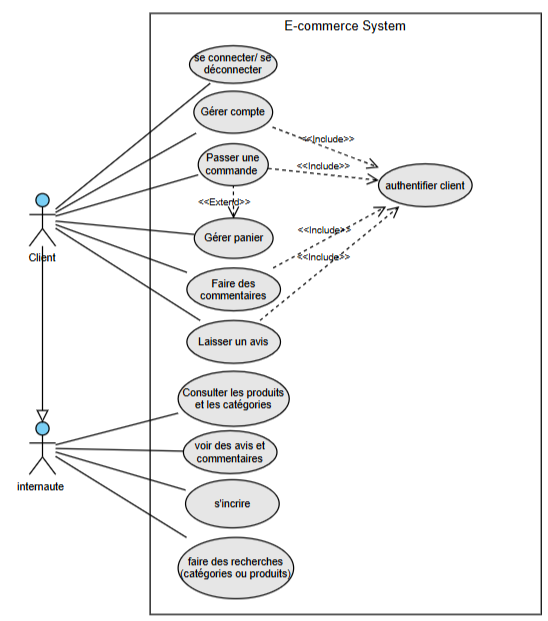

= Document de Conception

Par : Ducry Pierre-Louis, Da Chao Romain, Razafinirina Mialisoa, Pellegatta Matteo
Pour : Brickolo
Date : 20/11/2024
Équipe : 2A7

== Introduction

== 1. Architecture système

=== 1.1 Architecture logicielle

L'architecture du système repose sur une structure en trois tiers :

Front-end : Développement en HTML, CSS et JavaScript pour l'interface utilisateur.

Back-end : Utilisation de PHP pour la gestion des requêtes et des processus métier.

Base de données : Stockage des informations dans une base MySQL. Les tables principales incluent :

Utilisateur (clients et administrateurs)

Produit (catalogue des produits disponibles)

Commande (suivi des achats clients)

Panier (gestion des sélections temporaires avant achat).

==== Diagramme de l'architecture logicielle :

+----------------+       +----------------+       +----------------+
| Interface web | <---> | Serveur PHP    | <---> | Base MySQL     |
+----------------+       +----------------+       +----------------+

=== 1.2 Logique métier (Diagramme des Classes Métier - DCM)

Le système repose sur les classes métier suivantes :

Utilisateur :

Attributs : idUtilisateur, nom, prenom, email, motDePasse, role (client ou admin).

Méthodes : inscription(), connexion(), deconnexion(), miseAJourProfil().

Produit :

Attributs : idProduit, nomProduit, description, prix, categorie, stock.

Méthodes : ajouterAuPanier(), rechercherProduit().

Commande :

Attributs : idCommande, idUtilisateur, dateCommande, montantTotal.

Méthodes : confirmerCommande(), suivreCommande().

Panier :

Attributs : idPanier, idUtilisateur, produits, quantiteTotale, montantTotal.

Méthodes : ajouterProduit(), supprimerProduit(), viderPanier().

== 2. Description des fonctionnalités

=== 2.1 Diagramme des Cas d’Utilisation (DCU)

==== Internaute et client

==== Tableau des cas d’utilisation principaux :

[cols="1,3,1,2,2", options="header"]
|===
| Cas d'utilisation            | Description                                      | Acteur principal | Préconditions          | Postconditions

| Consulter les produits       | L'utilisateur peut voir les produits disponibles | Internaute       | Aucun                  | Liste des produits affichée| S'inscrire                   | Un internaute peut créer un compte client        | Internaute       | Aucun                  | Compte créé avec succès| Se connecter                 | Un client ou un admin peut se connecter          | Client/Admin     | Compte existant        | Accès au système sécurisé| Ajouter un produit au panier | Le client peut ajouter un produit à son panier  | Client           | Connecté, produit dispo| Produit ajouté au panier| Passer une commande          | Le client peut valider son panier               | Client           | Panier non vide        | Commande validée, panier vidé|===

=== 2.2 Diagrammes de Séquence Système (DSS)

==== 2.2.1 Client non connecté

Action principale : L'utilisateur consulte les produits et crée un compte.

Utilisateur -> Interface web : Consulte les produits
Interface web -> Serveur PHP : Requête des produits disponibles
Serveur PHP -> Base MySQL : Récupère les produits
Base MySQL -> Serveur PHP : Retourne les produits
Serveur PHP -> Interface web : Affiche les produits
Utilisateur -> Interface web : S'inscrit
Interface web -> Serveur PHP : Requête d'inscription
Serveur PHP -> Base MySQL : Crée un nouvel utilisateur
Base MySQL -> Serveur PHP : Confirmation d'inscription
Serveur PHP -> Interface web : Message de succès

==== 2.2.2 Client connecté

Action principale : Le client ajoute des produits au panier et passe une commande.

Client -> Interface web : Ajoute un produit au panier
Interface web -> Serveur PHP : Requête d'ajout au panier
Serveur PHP -> Base MySQL : Met à jour le panier du client
Base MySQL -> Serveur PHP : Confirmation de mise à jour
Serveur PHP -> Interface web : Produit ajouté au panier
Client -> Interface web : Passe une commande
Interface web -> Serveur PHP : Requête de commande
Serveur PHP -> Base MySQL : Crée une nouvelle commande
Base MySQL -> Serveur PHP : Confirmation de commande
Serveur PHP -> Interface web : Commande validée

==== 2.2.3 Administrateur

Action principale : Gestion du catalogue de produits.

Admin -> Interface web : Ajoute un nouveau produit
Interface web -> Serveur PHP : Requête d'ajout de produit
Serveur PHP -> Base MySQL : Ajoute le produit au catalogue
Base MySQL -> Serveur PHP : Confirmation d'ajout
Serveur PHP -> Interface web : Produit ajouté avec succès
Admin -> Interface web : Supprime un produit
Interface web -> Serveur PHP : Requête de suppression
Serveur PHP -> Base MySQL : Supprime le produit du catalogue
Base MySQL -> Serveur PHP : Confirmation de suppression
Serveur PHP -> Interface web : Produit supprimé
