= Documentation Utilisateur
:toc-title: Sommaire
:toc: macro

*Par :* _Ducry Pierre-Louis, Da Chao Romain, Razafinirina Mialisoa, Pellegatta Matteo_ +
*Pour :* _Brickolo_ +
*Date :* 20/11/2024 +
*Équipe : 2A7* 

---
toc::[]
---

== Introduction
Ce guide d’utilisation a été conçu pour vous accompagner dans la navigation sur notre site et pour vous permettre d’en tirer pleinement profit. Vous y trouverez des explications claires pour accéder aux différentes sections et fonctionnalités, ainsi que des instructions détaillées pour réaliser des actions courantes, telles que créer un compte ou consulter un produit. Nous vous remercions de votre confiance et vous souhaitons une excellente expérience sur notre site !

== Accéder au site web

=== Avec le réseau de l'IUT (filaire)
Afin d'accéder à notre site ouvrez votre navigateur web et saisissez l'adresse suivante : http://192.168.224.139/~R2024SAE3003/index.php

=== Avec votre propre réseau

Afin d'accéder à notre site ouvrez votre navigateur web et saisissez l'adresse suivante : http://193.54.227.164/~R2024SAE3003/index.php

== Présentation du site e-commerce 

=== Accueil

==== En-tête du site 

Lorsque vous êtes redirigé vers notre site vous arrivez sur la page d'accueil. Vous pouvez y accéder à tout moment en cliquant sur le logo de notre site en haut à gauche de la page.

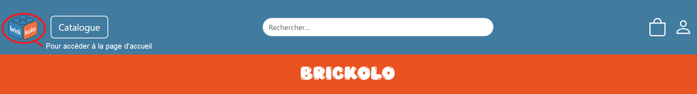

==== Pied de page du site

Le pied de page du site contient des informations sur notre société, les mentions légales, contacts ainsi que des liens vers nos réseaux sociaux. 

=== Connexion et création d'un compte
Pour se connecter, il vous suffit de cliquer sur l'icône de connexion située en haut à droite à cotê de l'icône du panier.

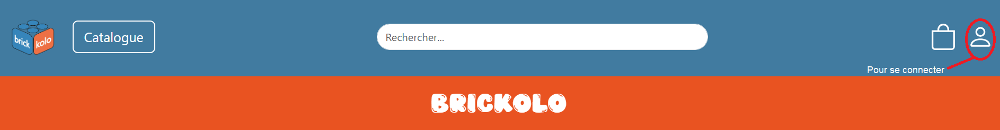

Puis vous devez saisier votre mail et votre mot de passe. En cas d'echec de connexion, des messages spécifiques s'afficheront.
Si vous avez pas encore de compte, en bas du formulaire de connexion, vous avez un lien qui vous redirige vers le formulaire d'inscription. 

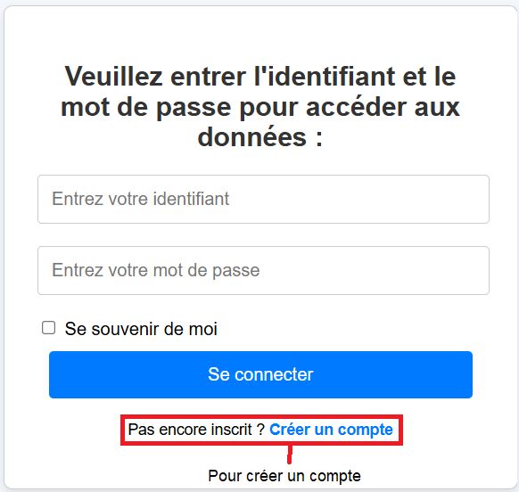

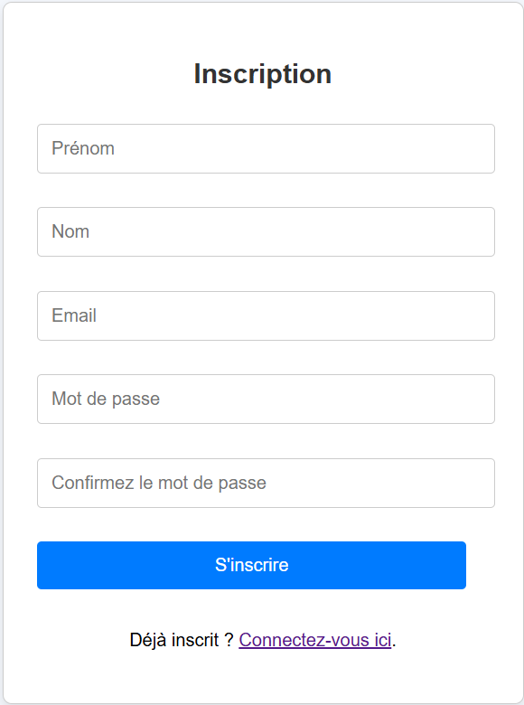

Suite à la créaction d'un compte,vous serez alors redirigé vers la page de connexion. 

Vous arriverez alors sur la page de création de compte. Il vous suffit de remplir les champs avec vos informations personnelles et de cliquer sur le bouton "valider".

Un compte sera alors crée avec succès. Vous pouvez maintenant vous connecter avec vos identifiants. 

Vous avez également une option "Se souvenir de moi" qui vous permettra de rester connecté sur notre site. Vous avez simplement à cocher la case correspondante. 

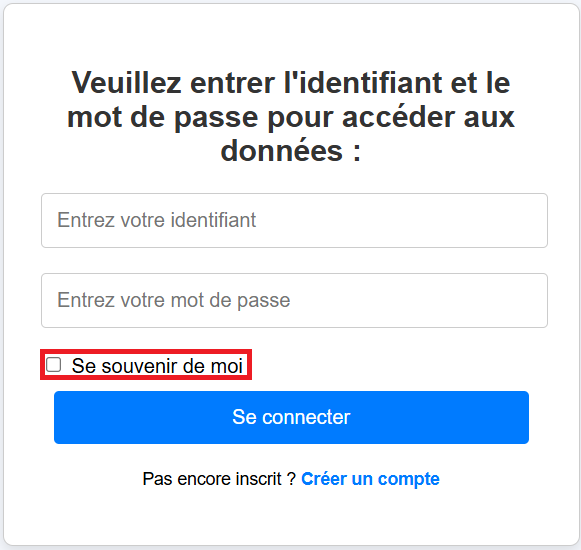

=== Deconnexion
Pour se déconnecter, il faut cliquer sur le bouton de deconnexion en haut à droite de l'icône de connexion. 

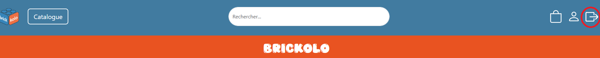

=== Recherche de produit 

Pour rechercher un produit, il vous suffit de cliquer sur la barre de recherche au milieu de la page et de saisir le nom du produit que vous souhaitez trouver. 

=== Consultation de tous les produits 
Pour consulter tous les produits en vente, il vous suffit de cliquer sur le bouton Catalogue à côté du logo de l'entreprise.
Cela vous redirigera sur une nouvelle page dans laquelle vous pourrez observer les divers produits disponibles.

image::../images/bouton_catalogue.png[pour accéder aux produits]

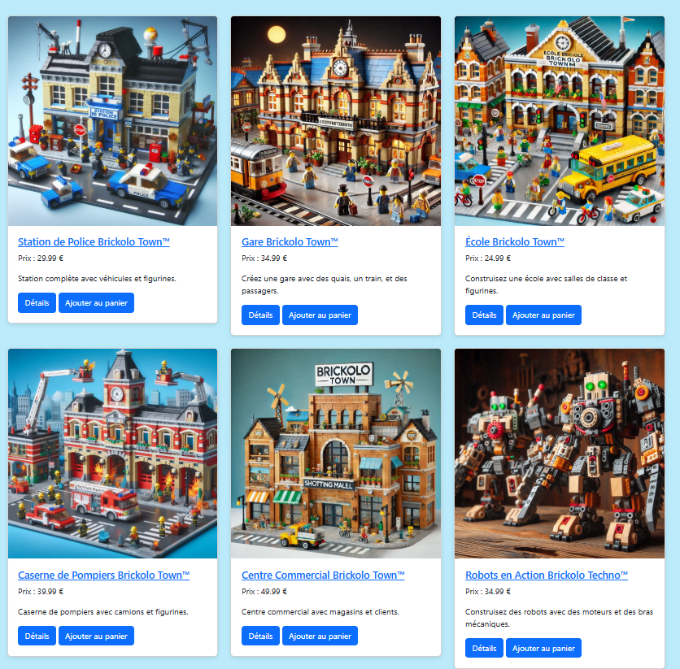

=== Trier les produits
L'utilisateur peut trier le produit par catégorie, nom de l'article, fourchette de prix, poids, dimensions, nombre de pièces, tranche d'âge, couluer et par prix (décroissant ou croissant). 
Pour afficher que les nouveaux produits, l'utilisateur doit cocher sur "Nouveauté". 

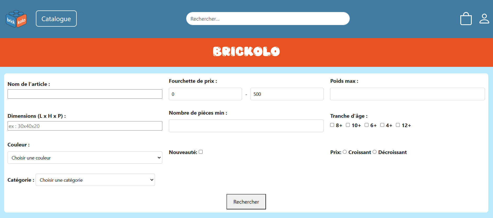

=== Consultation du panier

Pour accéder à votre panier, cliquez simplement sur l'icône en forme de panier située dans le coin supérieur droit de la page.

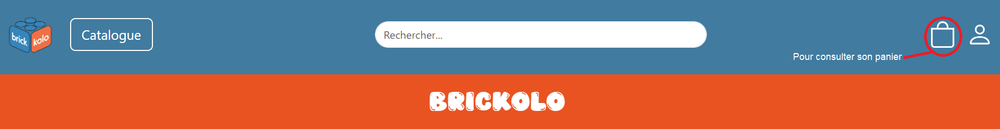

Dans votre panier, vous pourriez modifier la quantité des produits, supprimer des produits et choisir le mode de livraison. L'option d'emballage cadeau est aussi disponible pour l'utilisateur. 

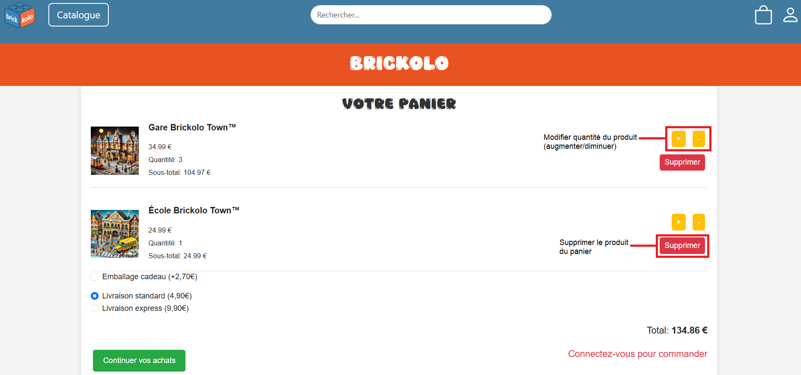

=== Passer une commande 
Pour passer une commande, l'utilisateur doit se rediriger vers son panier et tout en bas de la page, il doit appuyer sur le bouton "Passer la commande"

image::../images/passer_commande.png[bouton pour passer la commande]

Puis, il suffit de remplir tous les informations et cliquer sur le bouton "confirmer la commande". 

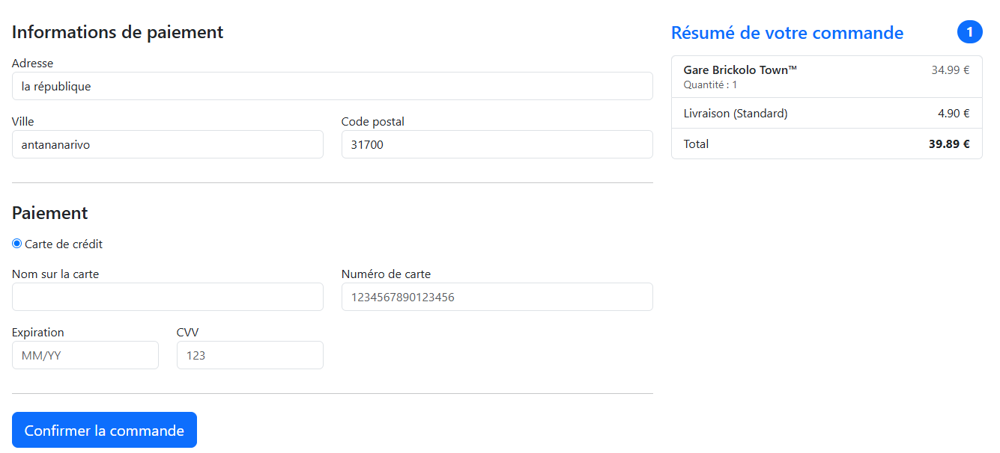

Si la commande a été bien effetuer, un message de confimartion est afficher. 

=== Consultation des détails d'un produit 

Pour afficher les détails d’un produit, cliquez simplement sur le bouton "Détails" situé sous l’image de chaque produit. 

image::../images/bouton_détail.png[bouton détail d'un produit, width= 300] 

Cela vous redirigera vers une nouvelle page où vous pourrez consulter tous les détails du produit sélectionné, tels que : le prix, la description, les couleurs disponibles, le poids, les dimensions, la tranche d’âge recommandée et le nombre d’unités en stock.

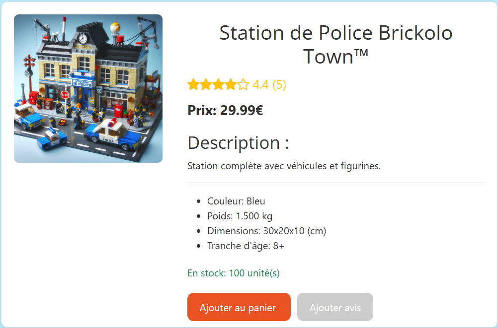

=== Ajout d'un avis
=== Consultation et modification les informations personnelles
=== Visualisation des dernières consulations 
=== Consultation des commandes 
=== Réalisation d'une commande

== Présentation des fonctionnalités pour les administrateurs 
=== 1. Gestion de produit 
==== Ajouter un produit 
==== Modifier un produit 
==== Supprimer un produit 

=== 2. Gestion des utitlisateurs 
==== Ajouter un utilisateur  
==== Modifier un utilisateur
==== Supprimer un utilisateur

== Diagrammes de collaboration pour faciliter la communication lors de la formation des futurs administrateurs du site 

=== 1. Diagramme pour le processus de création d’un produit

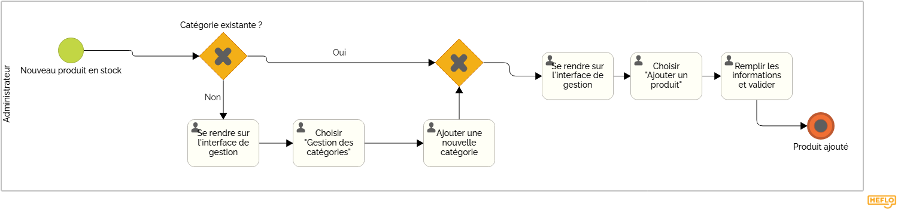

=== 2. Diagramme pour le suivi de la commande complète 

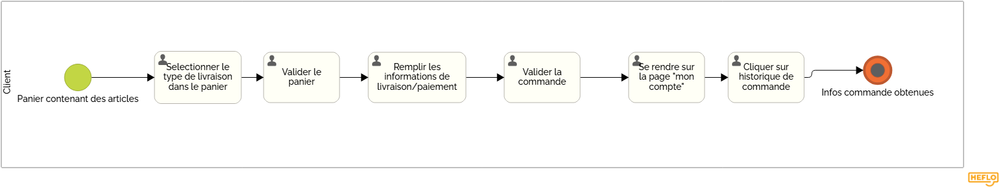

