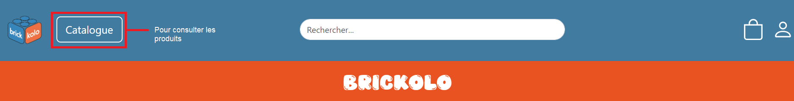

= Documentation Utilisateur
:toc-title: Sommaire
:toc: macro

*Par :* _Ducry Pierre-Louis, Da Chao Romain, Razafinirina Mialisoa, Pellegatta Matteo_ +
*Pour :* _Brickolo_ +
*Date :* 20/11/2024 +
*Équipe : 2A7* 

---
toc::[]
---

== Introduction
Ce guide d’utilisation a été conçu pour vous accompagner dans la navigation sur notre site et pour vous permettre d’en tirer pleinement profit. Vous y trouverez des explications claires pour accéder aux différentes sections et fonctionnalités, ainsi que des instructions détaillées pour réaliser des actions courantes, telles que créer un compte ou consulter un produit. Nous vous remercions de votre confiance et vous souhaitons une excellente expérience sur notre site !

== Accéder au site web

=== Avec le réseau de l'IUT (filaire)
Afin d'accéder à notre site ouvrez votre navigateur web et saisissez l'adresse suivante : http://192.168.224.139/~R2024SAE3003/index.php

=== Avec votre propre réseau

Afin d'accéder à notre site ouvrez votre navigateur web et saisissez l'adresse suivante : http://193.54.227.164/~R2024SAE3003/index.php

== Présentation du site e-commerce 

=== Accueil

==== En-tête du site 

À votre arrivée sur notre site, vous serez redirigé vers la page d'accueil. Vous pouvez y revenir à tout moment en cliquant sur le logo situé en haut à gauche.

image::../images/entête_PgAcceuil.png[title = "accueil"]

==== Pied de page du site

Le pied de page contient des informations essentielles telles que :

* Les mentions légales
* Les coordonnées de contact
* Des liens vers nos réseaux sociaux

=== Connexion et création d'un compte
Pour vous connecter, cliquez sur l’icône de connexion située en haut à droite, à côté de l’icône du panier.

image::../images/icone_connexion.png[title = "Pour se connecter"]

Entrez ensuite votre email et votre mot de passe, puis appuyer sur "se connecter". En cas d'échec, un message d'erreur s'affichera.

image::../images/formulaire_connexion.png[title = "formulaire de connexion", width=300]

Si vous ne possédez pas encore de compte, cliquez sur le lien d'inscription en bas du formulaire de connexion.

 

Après avoir rempli le formulaire avec vos informations personnelles, cliquez sur "s'incrire". Une fois votre compte créé avec succès, vous serez redirigé vers la page de connexion.

Option supplémentaire : activez "Se souvenir de moi" pour rester connecté en cochant la case correspondante. 

=== Deconnexion
Pour vous déconnecter, cliquez sur l'icône de déconnexion en haut à droite, à côté de l’icône de connexion.

image::../images/deconnexion.png[title = "deconnexion"]

=== Recherche de produit 

Pour rechercher un produit, il vous suffit de cliquer sur la barre de recherche au milieu l'entête et de saisir le nom du produit que vous souhaitez trouver. 

image::../images/barre_recherche.png[title = "rechercher un produit"]

=== Consultation de tous les produits 
Pour afficher tous les produits disponibles, cliquez sur le bouton Catalogue situé à côté du logo de l’entreprise.
Cela vous redirigera sur une nouvelle page dans laquelle vous pourrez observer les divers produits disponibles.

=== Trier les produits
Les produits peuvent être triés selon plusieurs critères :

* Catégorie
* Nom de l’article
* Fourchette de prix
* Poids, dimensions
* Tranche d’âge, couleur
* Prix (croissant ou décroissant)

Pour afficher que les nouveaux produits, l'utilisateur doit cocher sur "Nouveauté". 

=== Consultation du panier

Pour accéder à votre panier, cliquez sur l'icône panier en haut à droite de la page.

image::../images/icone_panier.png[title = "icône panier"]

Dans votre panier, vous pourriez modifier la quantité des produits, supprimer des produits et choisir le mode de livraison. L'option d'emballage cadeau est aussi disponible pour l'utilisateur. 

=== Passer une commande 
Pour passer une commande, accédez à votre panier et cliquez sur le bouton "Passer la commande" situé en bas de la page.

Remplissez ensuite les informations nécessaires et cliquez sur "Confirmer la commande".

image::../images/commande.png[title = "Page commande", width= 700]

Une fois la commande validée, un message de confirmation s’affichera.

=== Consultation des détails d'un produit 

Pour consulter les détails d’un produit, cliquez sur le bouton "Détails" sous l’image de l’article souhaité.

image::../images/bouton_détail.png[title = "bouton détail d'un produit", width= 300] 

Cela vous redirigera vers une nouvelle page où vous pourrez consulter tous les détails du produit sélectionné, tels que : le prix, la description, les couleurs disponibles, le poids, les dimensions, la tranche d’âge recommandée et le nombre d’unités en stock.

=== Ajout d'un avis
=== Consultation et modification les informations personnelles
=== Visualisation des dernières consulations 
=== Consultation des commandes 
=== Réalisation d'une commande

== Présentation des fonctionnalités pour les administrateurs 
=== 1. Gestion de produit 
==== Ajouter un produit 
==== Modifier un produit 
==== Supprimer un produit 

=== 2. Gestion des utitlisateurs 
==== Ajouter un utilisateur  
==== Modifier un utilisateur
==== Supprimer un utilisateur

== Diagrammes de collaboration pour faciliter la communication lors de la formation des futurs administrateurs du site 

=== 1. Diagramme pour le processus de création d’un produit

=== 2. Diagramme pour le suivi de la commande complète 

