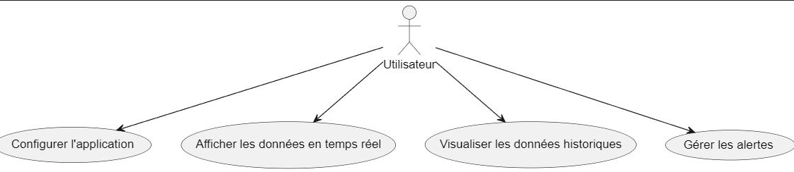

= Documentation Application
:toc-title: Sommaire
:toc: macro

*Par :* _Ducry Pierre-Louis, Da Chao Romain, Razafinirina Mialisoa, Pellegatta Matteo_ +
*Pour :* André Peninou +
*Date :* 08/12/2024 +
*Équipe :* 2A7

---
toc::[]
---

== I. Présentation de l'application

L’application développée vise à gérer et surveiller les données en provenance de capteurs et de panneaux solaires, avec un focus particulier sur les alertes environnementales. Elle se compose de deux parties principales : un programme en Java qui assure la gestion de l’interface utilisateur et un programme en Python qui s’occupe de la gestion des capteurs et du traitement des données. Cette architecture permet une séparation claire des responsabilités tout en assurant une communication fluide entre les deux programmes via MQTT.

* **Surveillance des capteurs environnementaux**: Le programme Java permet de surveiller en temps réel les données provenant de différents capteurs (température, CO2, humidité), et de gérer des alertes lorsque des seuils sont dépassés.
* **Affichage graphique des données** : Une interface graphique permet d’afficher les valeurs des capteurs en temps réel et de visualiser l’historique sous forme de graphiques.
* **Intégration avec les panneaux solaires** : Le système permet de collecter et afficher les données des panneaux solaires pour visualiser leur production en temps réel.
* **Alertes et gestion des seuils** : Le programme Python détecte les dépassements de seuils définis dans un fichier de configuration et transmet les alertes à l’interface Java.
* **Communication entre Java et Python** : Le programme Java peut lancer et interagir avec le programme Python, en s’assurant que les deux parties fonctionnent en harmonie.
* **Gestion de la configuration** : L'utilisateur peut configurer le comportement du système via un fichier de configuration qui définit les types de données à récupérer, la fréquence de lecture, les seuils d’alerte, et d'autres paramètres.

== II. Architecture

=== 1. Model (Modèle)

Le modèle gère les différentes données. Dans ce système, il est responsable de :

* La gestion des capteurs (récupération des données, détection des alertes sur les seuils).
* La gestion des données solaires et de leur conversion en objet java.
* La lecture et l'écriture des données dans des fichiers config.ini envoyées par le programme Python.

Le modèle interagit avec les capteurs et les panneaux solaires pour récupérer les données via les json.

=== 2. View (Vue)

La vue est responsable de l'affichage des données à l'utilisateur. Elle représente l'interface graphique de l'application Java et est chargée de :

* Afficher les données en temps réel des capteurs (température, CO2, humidité) par salle.
* Visualiser les données historiques sous forme de graphiques pour une meilleure analyse (par exemple, la production des panneaux solaires).
* Fournir une interface permettant de configurer les paramètres via un fichier de configuration (type de données, fréquence de lecture, seuils d'alerte, etc.).

Les vues permettent une interaction avec l'utilisateur, comme la sélection des différentes salles ou la visualisation de certaines données sur des graphiques.

=== 3. Controller (Contrôleur)

Le contrôleur sert de lien entre la vue et le modèle. Il est responsable de la gestion des actions de l'utilisateur et de la mise à jour de l'affichage en fonction des données du modèle. Le contrôleur dans cette application va :

* Lancer une nouvelle scène et créer un viewcontroller.
* Lancer le programme Python qui lit les données des capteurs et des panneaux solaires.

== III. Fonctionnalités
=== 1. Lancer l'application
* **App.java** : Le fichier App.java permet de lancer l'application en appelant AccueilController.java

=== 2. Redirections de la page principale
* **AccueilController.java** : Initialise la fenêtre principlale et implémente les fonctions des boutons
* **Accueil.fxml** : Interface graphique de la fenêtre principale
* **AcueilViewController.java** : fait le lien entre le fxml et le controller en associant une fonction à chaque bouton

=== 3. Visualiser les panneaux solaire 
* **SolarEdgeController.java** : Initialise la fenêtre
* **SolarEdge.fxml** : Interface graphique de la fenêtre des données solaires
* **SolarEdgeViewController.java** : fait le lien entre le fxml et le controller en associant une fonction à chaque bouton et en créant les graphes
* **EnergieData.java** : Classe définissant les attributs des relevés solaires
* **JsonConverter.java** : Convertit les json en EnergieData
* **Solaredge_filtre_data.json** : stock les données des panneaux solaires

=== 4. Configuration
* **ConfigController.java** : Initialise la fenêtre
* **ConfigViewController.java** :Défini les actions des boutons de seuils et de relevés 
* **Config.fxml** : Interface graphique de configuration
* **INIReader.java** : permet la liaison entre le viewController et le fichier config.ini
* **config.ini** : stock les données de configuration des données

== IV. Eléments essentiels à connaître

== V. Conclusion

Cette documentation technique présente les éléments essentiels à connaître pour comprendre l'application e-commerce, les technologies utilisées, ainsi que les fonctionnalités développées. Elle sert de référence pour la maintenance et l'extension future de l'application.

